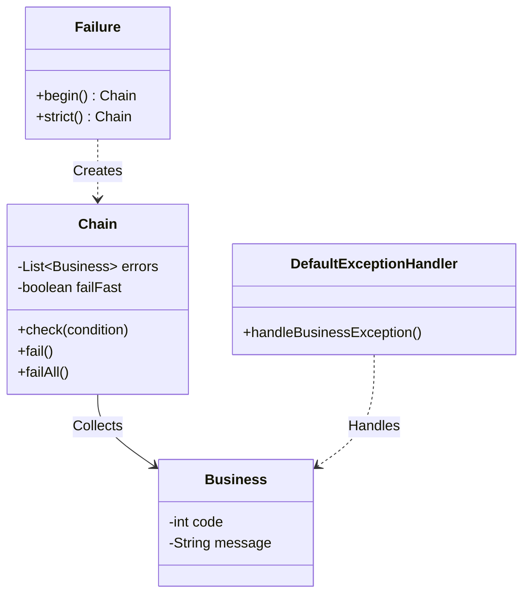

# Fail-Fast Spring Boot Starter

[](https://github.com/KyrieChao/Failure/actions/workflows/ci.yml)
[](https://codecov.io/gh/KyrieChao/Failure)
[](https://jitpack.io/#KyrieChao/Failure)
[](LICENSE)

**Fail-Fast** 是一个专为 Spring Boot 3.x 设计的轻量级、高性能参数校验与业务异常处理框架。它秉承 "Fail Fast, Fail Safe" 的设计哲学，提供流式 API（Fluent API）、注解驱动以及函数式结果处理三种使用模式，旨在解决传统 `if-else` 参数校验代码冗余、错误码管理混乱以及异常处理不统一的痛点。

核心特性包括：
- **链式校验**：提供优雅的 Fluent API，支持 `fail-fast`（快速失败）与 `fail-safe`（全量收集）两种模式。
- **丰富的断言库**：内置对象、字符串、数值、集合、日期、枚举、Optional 等上百种校验方法。
- **高级特性**：支持跨字段比较 (`compare`)、自定义断言 (`satisfies`) 以及反应式失败回调 (`onFail`)。
- **函数式编程**：提供 `Result<T>` 单子（Monad）类型，支持不抛出异常的错误处理流。
- **注解驱动**：无缝集成 Spring AOP，支持声明式校验 (`@Validate`) 与自定义验证器 (`FastValidator`)。
- **灵活配置**：支持错误码到 HTTP 状态码的范围映射（如 `40100..40199` -> `401`）及影子追踪调试。

---

## 快速开始 (Quick Start)

### 1. 环境要求 (Prerequisites)

- **Java**: 17+
- **Spring Boot**: 3.2.x

### 2. 实战示例 (Action Example)

为了帮助您更快上手，我们提供了一个完整的实战示例项目 **[Failure-in-Action](https://github.com/KyrieChao/Failure-in-Action)**。该项目演示了如何在真实的业务场景（如用户注册、登录）中集成 Fail-Fast，包含以下最佳实践：

- **集中式校验**：使用 `TypedValidator` 管理 DTO 校验逻辑。
- **混合校验模式**：结合流式 API 进行基础格式校验，与自定义业务逻辑（如数据库查重）。
- **安全实践**：展示如何在校验通过后进行密码加盐、脱敏等操作。
- **全局异常处理**：标准化的异常响应结构。

建议您 clone 该仓库作为参考：
```bash
git clone https://github.com/KyrieChao/Failure-in-Action.git
```

### 3. 引入依赖 (Installation)

#### 方式一：使用 JitPack (推荐)

无需等待 Maven Central 同步，直接使用 GitHub 最新版本。

第一步：在项目的 `pom.xml` 中添加 JitPack 仓库：

```xml
<repositories>
    <repository>
        <id>jitpack.io</id>
        <url>https://jitpack.io</url>
    </repository>
</repositories>
```

第二步：添加依赖：

```xml
<dependency>
    <groupId>com.github.KyrieChao</groupId>
    <artifactId>Failure</artifactId>
    <version>Tag</version> <!-- 建议使用最新 Release 版本，例如 1.2.0 -->
</dependency>
```

#### 方式二：本地安装 (Local Development)

如果您下载了源码，可以通过 Maven 安装到本地仓库：

```bash
git clone https://github.com/KyrieChao/Failure.git
cd fail-fast-improved
mvn clean install
```

然后在项目中引入：

```xml
<dependency>
    <groupId>com.chao</groupId>
    <artifactId>fail-fast-spring-boot-starter</artifactId>
    <version>1.2.0</version>
</dependency>
```

### 3. 最小可运行示例

在 Service 或 Controller 中使用 `Failure.begin()` 开启链式校验：

```java
import com.chao.failfast.Failure;
import com.chao.failfast.internal.ResponseCode;

@Service
public class UserService {

    public void register(UserDTO user) {
        // 开启快速失败校验链
        Failure.begin()
            .notNull(user, ResponseCode.PARAM_ERROR)                   // 校验对象非空
            .notBlank(user.getUsername(), ResponseCode.NAME_EMPTY)     // 校验字符串非空
            .match(user.getPhone(), "^1[3-9]\\d{9}$", ResponseCode.PHONE_INVALID) // 正则校验
            .satisfies(user.getAge(), age -> age >= 18, ResponseCode.AGE_INVALID) // 自定义 Predicate
            .fail(); // 执行校验，遇错即抛出异常

        // 业务逻辑...
    }
}
```

---

## 系统架构与模块 (Architecture)

### 核心模块划分

项目采用清晰的模块化设计，核心包结构如下：

- **`com.chao.failfast`**: 核心入口 (`Failure`)。
- **`advice`**: 全局异常处理，负责将 `Business` 异常转换为标准 HTTP 响应。
- **`annotation`**: 定义 `@Validate`, `@FastValidator` 等注解。
- **`aspect`**: AOP 切面实现，处理注解驱动的校验逻辑。
- **`config`**: 自动配置与错误码映射配置 (`CodeMappingConfig`)。
- **`internal`**: 内部核心逻辑。
    - **`Chain`**: 校验链核心实现，管理校验状态与错误收集。
    - **`check`**: 具体的校验工具集 (`StringChecks`, `NumberChecks`, `OptionalChecks` 等)。
- **`result`**: 函数式结果封装 (`Result<T>`)。

### 关键类图 (Key Classes)



---

## 核心特性详解 (Core Features)

### 1. 编程式链式校验 (Fluent Validation)

Fail-Fast 提供灵活的校验模式，满足不同场景需求。

#### 基础校验
```java
Failure.begin()
    .exists(user, UserCode.NOT_EXIST)
    .notBlank(user.getUsername(), UserCode.USERNAME_BLANK)
    .fail();
```

#### 高级校验 (New)
支持 `Optional`、自定义谓词 (`Predicate`) 和跨字段比较 (`Comparator`)。

```java
Failure.begin()
    // Optional 校验
    .isPresent(Optional.ofNullable(token), AuthCode.TOKEN_MISSING)
    
    // 自定义逻辑 (Satisfies)
    .satisfies(user.getBalance(), bal -> bal.compareTo(BigDecimal.ZERO) > 0, UserCode.BALANCE_LOW)
    
    // 跨字段比较 (Compare)
    .compare(startTime, endTime, (t1, t2) -> t1.isBefore(t2) ? 0 : -1, CommonCode.TIME_ORDER_ERROR)
    
    // 失败回调 (Reactive)
    .onFail(() -> log.error("Validation failed for user: {}", user.getId()))
    .fail();
```

### 2. 注解驱动校验 (Annotation Driven)

通过 `@Validate` 注解与 `FastValidator` 接口，实现业务校验逻辑的解耦与复用。推荐使用 **混合校验模式**，即先进行低成本的格式校验，通过后再进行高成本的业务校验（如数据库查询）。

```java
// 1. 定义验证器
@Component
public class UserValidator extends TypedValidator {

    public UserValidator() {
        register(UserDTO.class, this::validateUser);
    }

    private void validateUser(UserDTO dto, ValidationContext ctx) {
        // 第一步：基础格式校验（使用 Failure.with(ctx)）
        // 如果开启了 fail-fast，一旦格式错误，ctx 会被标记为 stopped
        Failure.with(ctx)
                .notBlank(dto.getUsername(), UserCode.USERNAME_BLANK)
                .email(dto.getEmail(), UserCode.EMAIL_INVALID)
                .verify(); // 语义化结束，实际错误已报告给 ctx

        // 第二步：检查是否需要继续
        // 如果基础格式已有错误，直接返回，避免执行昂贵的数据库查询
        if (ctx.isFailed()) {
            return;
        }

        // 第三步：业务逻辑校验（高成本操作）
        if (userMapper.exists(dto.getUsername())) {
            ctx.reportError(ResponseCode.USER_EXISTS);
        }
    }
}

// 2. 使用注解
@PostMapping("/users")
@Validate(value = UserValidator.class, fast = true)
public Result<Void> createUser(@RequestBody UserDTO user) {
    userService.create(user);
    return Result.ok();
}
```

### 3. 函数式结果处理 (Functional Result)

使用 `Result<T>` 替代异常抛出，编写更加函数式的代码。

```java
// 包装可能抛出异常的调用
Result<User> result = Results.tryOf(() -> userService.findUser(id), ResponseCode.DB_ERROR);

// 链式处理
UserDTO dto = result.filter(u -> u.isActive(), ResponseCode.USER_LOCKED)
                    .map(UserMapper::toDTO)
                    .recover(err -> UserDTO.guest()) // 降级处理
                    .get();
```

---

## 配置详解 (Configuration)

支持在 `application.yml` 中配置错误码映射与调试选项。

```yaml
fail-fast:
  # 开启影子追踪：在异常响应中包含触发校验的代码位置（仅开发环境推荐）
  shadow-trace: true
  
  # 是否开启详细模式：在 fail-safe 模式下返回所有错误详情
  verbose: true
  
  code-mapping:
    # 明确的状态码映射
    http-status:
      40001: 400
      40100: 401
    
    # 错误码分组与范围映射
    groups:
      # 支持范围语法 "start..end" 或 "start-end"
      auth: [ "40100..40199" ] 
      business: [ "40000..40099", 42200 ]
```

**映射规则优先级：**
1.  标准 HTTP 状态码 (100-599)
2.  精确配置匹配
3.  前缀范围匹配 (如 401xx -> 401)
4.  大类兜底 (4xxxx -> 400, 5xxxx -> 500)

---

## 本地开发指南 (Development)

### 构建项目
```bash
# 编译并跳过测试
mvn clean package -DskipTests

# 安装到本地仓库
mvn clean install
```

### 运行测试
项目包含单元测试与集成测试，覆盖核心校验逻辑。
```bash
mvn test
```

### 提交规范
- 请确保新增代码包含相应的单元测试。
- 遵循现有的代码风格（Lombok, Fluent API）。

---

## 版本变更 (Changelog)

### v1.2.0 (Current)
- **Feat**: 新增 `Optional` 校验支持 (`isPresent`, `isEmpty`)。
- **Feat**: 新增 `satisfies` 通用谓词校验与 `compare` 比较校验。
- **Feat**: 支持反应式失败回调 `onFail` / `onFailGet`。
- **Feat**: 增强 `CodeMappingConfig`，支持 YAML 范围语法配置错误码映射。
- **Refactor**: 优化 `Chain` 类结构，全面委托给 `internal.check` 工具类。

---

**Fail-Fast** is open source software released under the [Apache 2.0 license](https://www.apache.org/licenses/LICENSE-2.0.html).
